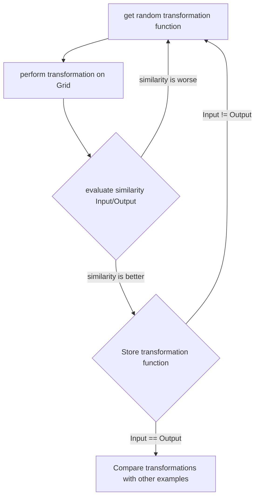
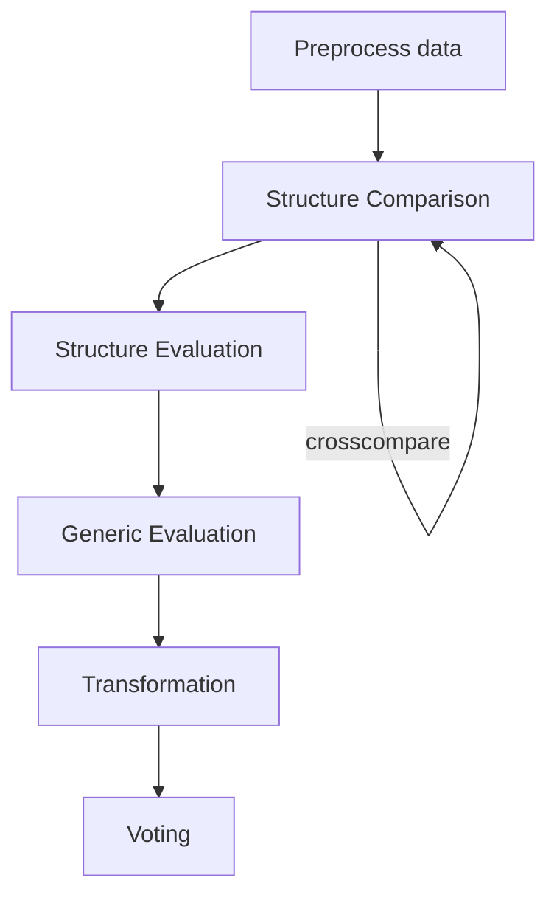

#  ARCathon Team Hitchhikers
## Introduction

A little more than three months ago, in the first lecture of the module "Artificial Intelligence", we were introduced to the ARC Challenge.
Immediately we knew that this would be a very interesting and challenging work for each of us.
So we, Matthias Koch, Gabriel Nobel, Rebekka von Wartburg, Tobias Wehrli and Oliver Wiedler, formed the team Hitchhikers and registered for [ARC](https://lab42.global/arcathon/).
This was followed by a time in which we dealt intensively with the ARC problems, solved many of these problems ourselves and analyzed them. This includes [visualizing and labeling](playground/ARCathon_label_dataset.ipynb) the training/validation data from ARC.
From this we came up with different ideas how to approach the task of finding a "solution" to the abstract reasoning challenge.

In the end it was fun to work on the challenge and even if we didn't manage to achieve everything we have some satisfying [results and conclusions](results_conclusions.md).

##  Implementation Guidelines
In this section we describe what our implementation guidelines are. They are kept as simple as possible so that everyone does the implementation process in the same way.

1. Pick a functionality which is not implemented yet but intrests you and create a branch with `feat/<functionality_name>`.

2. Implement the functionality **locally** as you wish in python, pay attention to the readability of the code and variables and add comments where necessary.

3. Create some simple examples to verify it working properly and paste these "tests" into the .ipby file, it's very welcome to use existing test-cases as examples.

4. Create a merge request which has to be reviewed by minimum one other person.

5. If everything is okay, thank you very much for your contribution, we are one step further!

##  Definitions

In this section we try to find a common vocabulary for our technical solution, so everyone knows imediately what we talk about.

 - A **Pixel** is one Square of an ARC Task Input and is described in more detail below.
 - A **Grid** is the whole Input of an ARC Task and contains multiple objects and pixels.
 - An **Object** is a "small" Grid, which represents a collection of pixels that have a dependency to each other.
 - A **[Correlation](correlations.md#correlation-attributes)** is a value that compares two grids, objects or pixels and tries to describe their similarity.

More Details for **Pixel, Grid, Object** can be found in the [preprocessing](preprocessing.md).

###  Grid indicies

Pixels have to be accessed as numpy array ( i.e. input for pixel (x,y)=[y,x])

|  |  |  |  |
|--|--|--|--|
| [0,0] | [0,1] | [0,2] | [0,3] |
| [1,0] | [1,1] | [1,2] | [1,3] |
| [2,0] | [2,1] | [2,2] | [2,3] |
| [3,0] | [3,1] | [3,2] | [3,3] |

###  How are boundaries handled

All Datapoints outside of our grid should have the same value **-1**

##  Strategies

In this section we try to define our overall strategy(s) which we try to think through and implement with the given time we have.

### Attempt Number One (deprecated)
Our first thought was to create as much transformation functions like `rotate`, `flip` or `gravitate` and try to figure out a way for getting as fast as possible to our solution. In our mind we could "store" the used functions and reuse them on another known Input/Output set to  check if this is the right chaining of functions:

as soon as we finished this process with all the examples of a given task, we would be able to predict the transformation chains with leads to the right solution.

#### Insight Number One
After little consideration we were not as convinced as at the beginning, that we would get anywhere with this approach. When thinking about this, we realised that the transformation lists for each input/output could look completely different. So we decided, that we had to **compare this lists with some kind of heuristics**.

#### Insight Number Two
Secondly it was pretty obvious that a random selection of transformations leads to a pretty inefficient solution. Because of that we decided, that we had to **Prune and classify the problems as good as possible. To do that we need as much information as we can get in advance**

#### Insight Number Three
 We started thinking about what we try to achieve. One very important piece in our thinking step was to listen to the thoughts Francoise Chollet (for example in [this Video](https://www.youtube.com/watch?v=jkBCyingDbk)) and to try to understand the ARC tasks as good as we could. Pretty fast we came across four different components that are mentioned and needed to be fullfilled to solve the ARC problem, namely **Objectness**, **Agentness**, **Numbers**, **Geometry** (OANG). Now wouldn't it be a good point to start from to create functions which are attuned to these concepts?

#### Objectness
A human environment is full of objects which change or interact with each other. In our environment (the NxM Grid) we should be possible to detect objects, compare them and get conclusions for the final result out of them.
##### Changing Objects
* Change Color
* Change Position
* Rotate
* Flip
* Duplicate
* Split
* Extend
* ...
##### Interacting Objects
* Bounce off
* Overlapp
* Outline
* Inline
* ...
#### Agentness

#### Numbers
* Compare / Subtract Numbers
	* Size
	* Number of different colors
	* Number of pixel by color
	* Number of same objects
	* Number of same patterns
	* Dimension
	* ...
#### Geometry
* Distance
* Scaling
* Orientation
* Object position
* ...

### Attempt Number Two (current)
With new insights and new experiences from coding different test methods, we have outlined a new strategy that we want to implement.

#### Preprocessing ([here](preprocessing.md))
In this step, grids, pixels and objects are processed in advance to find the greatest possible amount of information we can extract from a single Input. (see Definitions for more Detail)

#### Structure Comparison ([here](correlations.md))
Here, all possible input grids per task are compared with each other and generate different correlations

#### Structure Evaluation ([here](correlations.md#correlation-attributes))
In the evaluation step, we will use the correlation we created in Structure Comparison to evaluate all different  correlations. We try to extract the correlations of the correlations (if this makes any sense) and build a Grid, which contains generic versions of Pixel and Objects. Examples for generic versions of these things are:
* Pixel with [y,x] value set but a flexible color
* Pixel with flexible y coordinate but fixed x coordinate or color
* Object Array with two fixed objects with flexible Pixel Size
* ...

#### Generic Evaluator ([here](correlations.md#the-other-generated-value-will-be-a-grid-object-which-is-an-abstracton-of-the-compared-grids-as-follows))
These generic grids must then be compared with the output grids. If necessary, generic elements must be added or removed.

#### Transformation/Fuzzy Logic ([here](fuzzy_logic.md))

With the hopefully correct structure obtained from the previous steps, we now move on to the more fine-grained transformations, where we try to figure out not only the structure but also the transformations. We do this by taking the knowledge of the structure and using it to strategically perform a series of transformations (like rotate, flip, recolor...). For evaluation of the different transformations, a fuzzy logic will be considered.

#### Voting
We select the top 3 transformation chains. If a chain has 100% output everywhere (correct result) then we apply it to our test data set. (Idea): If not, we try to do dark magic and compare via index which transformations in our test data set were the highest score in an exercise which resembles the one we are solving as good as possible. Then we apply some of these transformations at random to our chain and hope for an improvement.

## Implemented Methods
* `add_border`: Adds a border around a grid so we can avoid out of bounds problems right at the beginning
* `get_pixel_neighbours`: returns all neighbours of one pixel
* `check_dimension`: returns if two grids have the same dimension (NxM)
* `check_same_color_sum`: returns if the colors of two grids are same and if not what the differences are
* `matrix_per_color`: returns an array of grids which are color separated
* `change_color_object`: returns a grid with multiple pixels with changed colors
* `move_pixel`: returns a grid with one pixel moved to a predefined position
* `move_object`: returns a grid with a object moved to a predefined position
* `rotate_180`: returnes a grid in reversed order
* `rotate_clockwise`: returns a grid with  clockwise rotation
* `rotate_anticlockwise`: returns a grid with anticlockwise rotations
* `flip_horizontally`: returns a grid which is flipped horizontally
* `flip_vertically`: returns a grid which is flipped vertically
* `gravitate_pixel`: returns a grid where one pixel is gravitated to the bottom
* `gravitate_object`: returns a grid where an object is gravitated to the bottom
* `connect_horizontal_vertical`:
* `connect_vertical_horizontal:`
* `connect_diagonal`:
* `find_objects`: returns a list with all objects of a grid

## Different Approaches originally discussed

### Per-Task Training
One approach that was initially discussed was the possibility on training a model on each task instead of having one algorithm to solve all of them.

#### Idea prerequisites

The basic idea here is that you have a neural network. This network represents a function in a classic Ai sense. If you have for example 3 inputs and 3 correct outputs, this network is able to learn a mapping (function) between those inputs and outputs (depending on if each layer can be derivated, as far as I understood mathematically).

##### Simple Task Examples

Task 1
||||
|---|---|---|
| 0 | 0 | 0 |
| 0 | 1 | 0 |
| 0 | 0 | 0 |

Solution 1
||||
|---|---|---|
| 0 | 1 | 0 |
| 0 | 0 | 0 |
| 0 | 0 | 0 |

Task 2
||||
|---|---|---|
| 0 | 0 | 0 |
| 0 | 0 | 1 |
| 0 | 0 | 0 |

Solution 2
||||
|---|---|---|
| 0 | 0 | 1 |
| 0 | 0 | 0 |
| 0 | 0 | 0 |

Task 3
||||
|---|---|---|
| 0 | 0 | 0 |
| 0 | 0 | 0 |
| 1 | 0 | 0 |

Solution 3
||||
|---|---|---|
| 0 | 0 | 0 |
| 1 | 0 | 0 |
| 0 | 0 | 0 |

-> Here the logic is that if there is a 1, it moves upwards.

A network is created with input grid 3x3 and output grid 3x3. The layers in between may be any kinds of layers.

If you train the network on these three problems only, the problem now is that this network will overfit.

Assumption 1: If the NN finds a solution to all three tasks, it can correctly solve the last task.

This assumption is wrong:

For example, the network would, after training, "contain" the human readable logic:
If there is a 1 on index (3,2), move it to index (3,1).
If there is a 1 on index (2,3), move it to index (2,2).
If there is a 1 on index (1,3), move it to index (1,2).

The model is overfitted. If you run this on a new task, it won't solve it.

The logic that we want is different though -> it would need to be:
If there is a 1, move the index of it up one row.

-> The correct logic is more general.

Assumption 2: If we find the most general solution that can solve a set of problems, it must be able to solve the task.

We seem to need a way to be able to find out if this code is general or not.

#### Kernel thoughts with example

A convoluted layer in a CNN has a kernel that modifies the input. With image stuff, this can be used to find edges. For our example here, using a kernel that looks like this:

||
|---|
| 0 |
| 1 |

would be able to solve the task above correctly in a single layer.

#### Functions to reduce complexity (Similar to our Fuzzy Logic)

If you were to just try possible permutations on the input to get to the output, you would probably never arrive at a solution because there are too many permutations one can do.

Because we as humans have reasoning, we know for example that a pixel could act like an object with gravity and fall down onto a floor. A computer doesn't. Which is why we want to help the computer by having these kinds of functions predefined.

If we have a limited amount of those functions, we can try to run the functions with random parameters to arrive at a set of function calls that arrive at the solution.

FindObject(1) -> moveObject(up, 1)

In my mind, to solve all ARC tasks, we would need to be able to create a domain language that contains all of the possible ways to interpret and modify the grid. 
