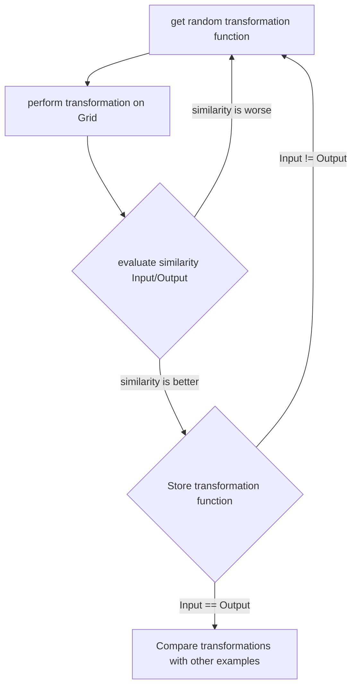
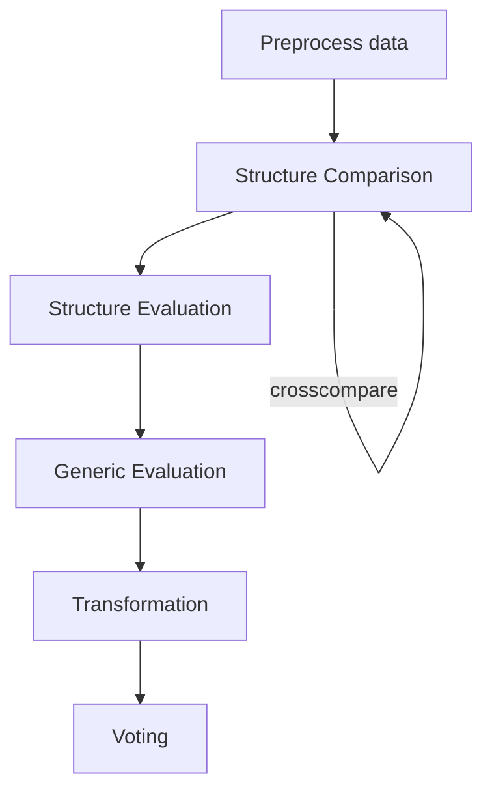

#  ARC Challenge Team Hitchhikers
##  Implementation Guidelines
In this section we describe what our implementation guidelines are. They are kept as simple as possible so that everyone does the implementation process in the same way.

1. Pick a functionality which is not implemented yet but intrests you and create a branch with `feat/<functionality_name>`.

2. Implement the functionality **locally** as you wish in python, pay attention to the readability of the code and variables and add comments where necessary.

3. Create some simple examples to verify it working properly and paste these "tests" into the .ipby file, it's very welcome to use existing test-cases as examples.

4. Create a merge request which has to be reviewed by minimum one other person.

5. If everything is okay, thank you very much for your contribution, we are one step further!

##  Definitions

In this section we try to find a common vocabulary for our technical solution, so everyone knows imediately what we talk about.

 - A **Pixel** is one Square of an ARC Task Input and is described in more detail below.
 - A **Grid** is the whole Input of an ARC Task and contains multiple objects and pixels.
 - An **Object** is a "small" Grid, which represents a collection of pixels that have a dependency to each other.
 - A **Colleration** is a value that compares two grids, objects or pixels and tries to describe their similarity.

###  Grid indicies

Pixels have to be accessed as normal array ( i.e. input for pixel (x,y)=[y,x])

|  |  |  |  |
|--|--|--|--|
| [0,0] | [0,1] | [0,2] | [0,3] |
| [1,0] | [1,1] | [1,2] | [1,3] |
| [2,0] | [2,1] | [2,2] | [2,3] |
| [3,0] | [3,1] | [3,2] | [3,3] |

###  How are boundaries handled

All Datapoints outside of our grid should have the same value **-1**
 
###  Pixels
A pixel defines one of the suqres in a grid. It has two values which are defined as follows:

* color: *Number | Value of pixel between 0-9*

* location: *Array | x and y coordinates in the grid [y,x]*

###  Grid (WIP)
A Grid is a two dimensional Array with shape *NxM* and it's values are defined as follows:

* **shape**: ***Array** | N and M of Array where N is vertically and M is horizontally [N,M]*

* **size**: ***Number** | sum of pixels in the Grid (NxM)*

* **pixels**: ***Array** | collection of all pixels which the grid contains*

* **colors**: ***Array** | all color values of the pixels array collected*

* **square**: ***Boolean** | if array of shape NxN then 1 else 0*

* **objects**: ***Array** | all clusters which can be found in the grid (objects)*

* **patterns**: ***Array** | all color specific patterns which can be found in the grid*  
  

###  Correlations (WIP)

To get the best possible result we want to find as many correlations as possible. Because of that we want to compare two Grids with each other. After comparing them with a `compare` function we will get a collection of information, we can use as colleration factors:

* **sameShape**: ***Boolean** | do the grids have the same shape (grid1.shape - grid2.shape == 0?)*

* **sameSize**: ***Boolean** | do the grids have the same size (grid1.size - grid2.size == 0?)*

* **sameColors**: ***Boolean** | do the grids have the same colors in them?*

* **colorDiff**: ***Array** | all colors which are in one but not in the other grod*

* **sameObjects**: ***Array** | all objects which can be found in both grids (with scaling or transformation)*

* **samePatterns**: ***Array** | all patterns which can be found in both grids (with scaling or transformation)*

* **overlayPoint**: ***Pixel** | the point which is most likely to be the top left corner of the smaller grid in the larger grid*

* **diff**: ***Grid** | a grid wich contains the difference between both (grid1 - grid2)*

##  Strategies

In this section we try to define our overall strategy(s) which we try to think through and implement with the given time we have.
 
### Attempt Number One
Our first thought was to create as much transformation functions like `rotate`, `flip` or `gravitate` and try to figure out a way for getting as fast as possible to our solution. In our mind we could "store" the used functions and reuse them on another known Input/Output set to  check if this is the right chaining of functions:

as soon as we finished this process with all the examples of a given task, we would be able to predict the transformation chains with leads to the right solution.

#### Insight Number One
After little consideration we were not as convinced as at the beginning, that we would get anywhere with this approach. When thinking about this, we realised that the transformation lists for each input/output could look completely different. So we decided, that we had to **compare this lists with some kind of heuristics**.

#### Insight Number Two
Secondly it was pretty obvious that a random selection of transformations leads to a pretty inefficient solution. Because of that we decided, that we had to **Prune and classify the problems as good as possible. To do that we need as much information as we can get in advance**

#### Insight Number Three
 We started thinking about what we try to achieve. One very important piece in our thinking step was to listen to the thoughts Francoise Chollet (for example in [this Video](https://www.youtube.com/watch?v=jkBCyingDbk)) and to try to understand the ARC tasks as good as we could. Pretty fast we came across four different components that are mentioned and needed to be fullfilled to solve the ARC problem, namely **Objectness**, **Agentness**, **Numbers**, **Geometry** (OANG). Now wouldn't it be a good point to start from to create functions which are attuned to these concepts?

#### Objectness
A human environment is full of objects which change or interact with each other. In our environment (the NxM Grid) we should be possible to detect objects, compare them and get conclusions for the final result out of them.
##### Changing Objects (WIP)
* Change Color
* Change Position* 
* Rotate
* Flip
* Duplicate
* Split
* Extend
* ...
##### Interacting Objects (WIP)
* Bounce off
* overlapp
* Outline
* Inline
* ...
#### Agentness (WIP)

#### Numbers (WIP)
* Compare / Subract Numbers
	* Size
	* Number of different colors
	* Number of pixel by color
	* Number of same objects
	* Number of same patterns
	* Dimension
	* ...
#### Geometry (WIP)
* Distance
* Scaling
* Orientation
* Object position
* ...

### Attempt Number Two
With new insights and new experiences from coding different test methods, we have outlined a new strategy that we want to implement.

#### Preprocessing
In this step, grids, pixels and objects are processed in advance to find the greatest possible amount of information we can extract from a single Input. (see Definitions for more Detail)

#### Structure Comparison
Here, all possible input grids per task are compared with each other. The `compare` function is called which returns a colleration.

#### Structure Evaluation
In the evaluation step, we will use the colleration we created in Structure Comparison to evaluate all different  collerations. We try to extract the collerations of the collerations (if this makes any sense) and build a Grid, which contains generic versions of Pixel and Objects. Examples for generic versions of these things are:
* Pixel with [y,x] value set but a flexible color
* Pixel with flexible y coordinate but fixed x coordinate or color
* Object Array with two fixed objects with flexible Pixel Size
* ...

#### Generic Evaluator
these generic grids must then be compared with the output grids. If necessary, generic elements must be added or removed.

#### Transformation

With the hopefully correct structure obtained from the previous steps, we now move on to the more fine-grained transformations, where we try to figure out not only the structure but also the transformations. We do this by taking the knowledge of the structure and using it to strategically perform a series of transformations (like rotate, flip, recolor...).
These should be done sequentially and individually and be provided with heuristics.

#### Voting
We select the top 3 transformation chains. If a chain has 100% output everywhere (correct result) then we apply it to our test data set. (Idea): If not, we try to do dark magic and compare via index which transformations in our test data set were the highest score in an exercise which resembles the one we are solving as good as possible. Then we apply some of these transformations at random to our chain and hope for an improvement.

## Implemented Methods
* `add_border`: Adds a border around a grid so we can avoid out of bounds problems right at the beginning
* `get_pixel_neighbours`: returns all neighbours of one pixel
* `check_dimension`: returns if two grids have the same dimension (NxM)
* `check_same_color_sum`: returns if the colors of two grids are same and if not what the differences are
* `matrix_per_color`: returns an array of grids which are color separated
* `change_color_object`: returns a grid with multiple pixels with changed colors
* `move_pixel`: returns a grid with one pixel moved to a predefined position
* `move_object`: returns a grid with a object moved to a predefined position
* `rotate_180`: returnes a grid in reversed order
* `rotate_clockwise`: returns a grid with  clockwise rotation
* `rotate_anticlockwise`: returns a grid with anticlockwise rotations
* `flip_horizontally`: returns a grid which is flipped horizontally
* `flip_vertically`: returns a grid which is flipped vertically
* `gravitate_pixel`: returns a grid where one pixel is gravitated to the bottom
* `gravitate_object`: returns a grid where an object is gravitated to the bottom
* `connect_horizontal_vertical`:
* `connect_vertical_horizontal:`
* `connect_diagonal`:
* `find_objects`(not finished): returns a list with all objects of a grid

## Idea List and stuff we didn't want to forget
- [Tobi's Eskapaden](https://github.com/Yingrjimsch/arcc_hitchhikers/blob/main/TobisEskapaden.md)
