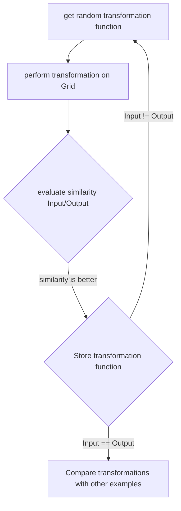

#  ARC Challenge Team Hitchhikers

##  Implementation Guidelines

1. Pick a functionality which is not implemented yet but intrests you and create a branch with feat/<functionality_name>

2. Implement the functionality locally as you wish in python.

3. Create some simple examples to verify it working properly and paste these "tests" into the .ipby file (with imports)

4. Create a merge request which has to be reviewed by minimum one other person

5. If everything is okay, thank you very much for your contribution!

  

##  Definitions

In this section we try to find a common vocabulary for our technical solution, so everyone knows imediately what we talk about.

###  Grid indicies

Pixels have to be accessed as normal array ( i.e. input for pixel (x,y)=[y,x])

| | | | |

|--|--|--|--|

| [0,0] | [0,1] | [0,2] | [0,3] |

| [1,0] | [1,1] | [1,2] | [1,3] |

| [2,0] | [2,1] | [2,2] | [2,3] |

| [3,0] | [3,1] | [3,2] | [3,3] |

  

###  How are boundaries handled

All Datapoints outside of our grid should have the same value **-1**

  

###  Pixels

A pixel defines one of the "fields" in a grid. It has two values which are defined as follows:

* color: *Number | Value of pixel between 0-9*

* location: *Array | x and y coordinates in the grid [y,x]*

  

###  Grid

A Grid is a two dimensional Array with shape NxM and it's values are defined as follows:

* shape: *Array | N and M of Array where N is vertically and M is horizontally [N,M]*

* size: *Number | Sum of pixels in the Grid (NxM)*

* pixels: *Array | Collection of all Pixels which the grid contains*

* colors: *Array | All color values of the pixels array collected*

* square: *Boolean | if array of shape NxN then 1 else 0*

* cluster: *Array | all clusters which can be found in the grid (objects)*

  
  

###  Correlations (Not Complete)

To get the best possible result we want to find as many correlations as possible. Because of that we want to compare two Grids with each other. After comparing them with a `compare` function we will get a collection of information, we can use as colleration factors:

* sameShape: *Boolean | do the grids have the same shape (grid1.shape - grid2.shape == 0?)*

* sameSize: *Boolean | do the grids have the same size (grid1.size - grid2.size == 0?)*

* sameColors: *Boolean | do the grids have the same colors in them?*

* colorDiff: *Array | all colors which are in one but not in the other grod*

* sameClusters: *Array | all clusters which can be found in both grids (with scaling or transformation)*

* diff: *Grid | a grid wich contains the difference between both (grid1 - grid2)*

  
  
  
  

###  Moonshots

* Wrap all matricies of the dimension n*m with a grid of the dimension n+2 x m+2 where the "border" contains a boundary value

  

##  Strategies

In this section we try to define our overall strategy(s) which we try to think through and implement with the given time we have.

  

Our first thought was it to create as much transformation functions like `rotate`, `flip` or `gravitate` and try to figure out a way for getting as fast as possible to our solution. In our mind we could "store" the used functions and reuse it on another known Input/Output set to double check if this is the right chaining of functions:

as soon as we finished this process with all the examples we could compare the transformation chains with each other.

After little consideration we were not as convinced as at the beginning, that we would get anywhere with this approach. Because of that we started thinking about what we try to achieve. One very important piece in our thinking step was to listen to Francoise Chollet in [this Video](https://www.youtube.com/watch?v=jkBCyingDbk). As he created the ARC dataset we thought, that we need to understand what his vision of ARC is. Pretty much at the beginning he mentioned four different components that needed to be fullfilled to solve the ARC problem, namely Objectness, Agentness, Numbers, Geometry (OANG). Now wouldn't it be a good point to start from to create functions which are attuned to these concepts? It might help, it might not but it doesn't hurt.
### Objectness
A human environment is full of objects which change or interact with each other. In our environment (the NxM Grid) we should be possible to detect objects, compare them and get conclusions for the final result out of them.
#### Changing Objects
* Change Color
* Change Position
* Scale
* Rotate
* Flip
* Duplicate
* Split
* Extend
* ...
#### Interacting Objects
* Bounce off
* overlapp
* Outline
* Inline
* ...
### Agentness

### Numbers
* Compare / Subract Numbers
	* Size
	* Number of different colors
	* Number of pixel by color
	* Number of same objects
	* Number of same patterns
	* Dimension
	* ...
### Geometry
* Distance
* Scaling
* Orientation
* Object position
* ...

# tobi's eskapaden

## Per-Task Training
One approach that was initially discussed was the possibility on training a model on each task instead of having one algorythm to solve all of them.

I'm just writing down my thought processes here.

### Idea prerequisites

The basic idea here is that you have a neural network. This network represents a function in a classic Ai sense. If you have for example 3 inputs and 3 correct outputs, this network is able to learn a correct mapping between those 3 inputs (depending on if each layer can be derivated, as far as I understood mathematically).

#### Simple Task Examples

Task1
||||
|---|---|---|
| 0 | 0 | 0 |
| 0 | 1 | 0 |
| 0 | 0 | 0 |

Solution1
||||
|---|---|---|
| 0 | 1 | 0 |
| 0 | 0 | 0 |
| 0 | 0 | 0 |

Task2
||||
|---|---|---|
| 0 | 0 | 0 |
| 0 | 0 | 1 |
| 0 | 0 | 0 |

Solution2
||||
|---|---|---|
| 0 | 0 | 1 |
| 0 | 0 | 0 |
| 0 | 0 | 0 |

Task3
||||
|---|---|---|
| 0 | 0 | 0 |
| 0 | 0 | 0 |
| 1 | 0 | 0 |

Solution3
||||
|---|---|---|
| 0 | 0 | 0 |
| 1 | 0 | 0 |
| 0 | 0 | 0 |

-> Here the logic is that if there is a 1, it moves upwards.

If you train the network on these three problems only, the problem now is that this network is overfitted.

Assumption 1: If the NN finds a solution to all three tasks, it can correctly solve the last task.

This assumption is wrong:

For example, the network would, after training, "contain" the human readable logic:
If there is a 1 on index (3,2), move it to index (3,1).
If there is a 1 on index (2,3), move it to index (2,2).
If there is a 1 on index (1,3), move it to index (1,2).

The model is overfitted. If you run this on a new task, it won't solve it.

The logic that we want is different though -> it would need to be:
If there is a 1, move the index of it up one row.

-> The correct logic is more general.

Assumption 2: If we find the most general solution that can solve a set of problems, it must be able to solve the task.

TODO: Find out if this assumption is correct.

We seem to need a way to be able to find out if this code is general or not.

### Functions to reduce complexity

If you were to just try possible permutations on the input to get to the output, you would probably never arrive at a solution because there are too many permutations one can do.

Because we as humans have reasoning, we know for example that a pixel could act like an object with gravity and fall down onto a floor. A computer doesn't. Which is why we want to help the computer by having these kinds of functions predefined.

If we have a limited amount of those functions, we can try to run the functions with random parameters to arrive at a set of function calls that arrive at the solution.

FindObject(1) -> moveObject(up, 1)

In my mind, to solve all ARC tasks, we would need to be able to create a domain language that contains all of the possible ways to interpret and modify the grid. 
