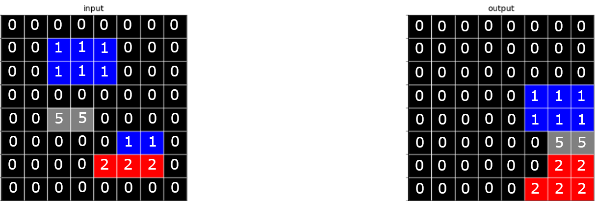
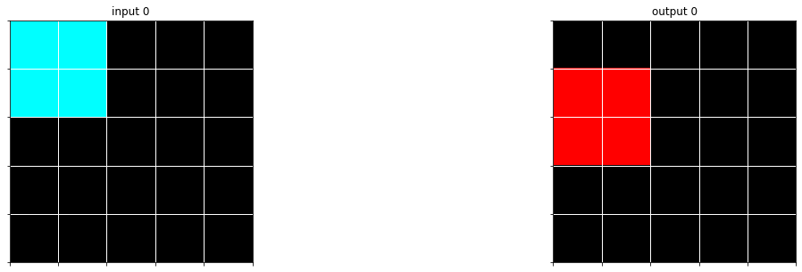
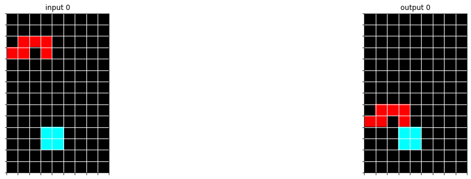

# Correlations
In this section it is briefly explained which correlations exist, how they are obtained and what the correlations method should return.

To get the best possible result the goal is to find as many correlations as possible. Because of that the Grids should be compared with each other as follows
1. X number of input and X number of output grids are generated from preprocessing and are given as parameters to the `correlate` function.
2. every input is compared with its specific output.
3. for every comparison a **correlation object** will be returned.

Future steps could be to also correlate input/input and output/output

## Example
As an example, the following input, output data are provided:



These two two-dimensional arrays are mapped into grids and look like this after preprocessing:

<table style="width: 100%; display: table">
<tr>
<th>Input</th>
<th>Output</th>
</tr>
<tr>
<td>

```json
{
    "raw": [
        [0,0,0,0,0,0,0,0],
        [0,0,1,1,1,0,0,0],
        [0,0,1,1,1,0,0,0],
        [0,0,0,0,0,0,0,0],
        [0,0,5,5,0,0,0,0],
        [0,0,0,0,0,1,1,0],
        [0,0,0,0,2,2,2,0],
        [0,0,0,0,0,0,0,0]
    ],
    "shape": [8,8],
    "sum": 24,
    "size": 13,
    "pixels": [
        ...
        {
            "color": 1,
            "coord": [1,2]
        },
        {
            "color": 1,
            "coord": [1,3]
        },
        {
            "color": 1,
            "coord": [1,4]
        },
		...
        {
            "color": 1,
            "coord": [2,2]
        },
        {
            "color": 1,
            "coord": [2,3]
        },
        {
            "color": 1,
            "coord": [2,4]
        },
        ...
        {
            "color": 5,
            "coord": [4,2]
        },
        {
            "color": 5,
            "coord": [4,3]
        },
        ...
        {
            "color": 1,
            "coord": [5,5]
        },
        {
            "color": 1,
            "coord": [5,6]
        },
		...
        {
            "color": 2,
            "coord": [6,4]
        },
        {
            "color": 2,
            "coord": [6,5]
        },
        {
            "color": 2,
            "coord": [6,6]
        },
        ...
    ],
    "colors": [0,1,2,5],
    "objects": [
        {
            "raw": [
                [1.0,1.0,1.0],
                [1.0,1.0,1.0]
            ],
            "shape": [2,3],
            "sum": 6.0,
            "size": 6,
            "pixels": [
                {
                    "color": 1,
                    "coord": [1,2]
                },
                {
                    "color": 1,
                    "coord": [1,3]
                },
                {
                    "color": 1,
                    "coord": [1,4]
                },
                {
                    "color": 1,
                    "coord": [2,2]
                },
                {
                    "color": 1,
                    "coord": [2,3]
                },
                {
                    "color": 1,
                    "coord": [2,4]
                }
            ],
            "colors": [1.0],
            "objects": null
        },
        {
            "raw": [
                [5.0,5.0]
            ],
            "shape": [1,2],
            "sum": 10.0,
            "size": 2,
            "pixels": [
                {
                    "color": 5,
                    "coord": [4,2]
                },
                {
                    "color": 5,
                    "coord": [4,3]
                }
            ],
            "colors": [5.0],
            "objects": null
        },
        {
            "raw": [
                [1.0,1.0]
            ],
            "shape": [1,2],
            "sum": 2.0,
            "size": 2,
            "pixels": [
                {
                    "color": 1,
                    "coord": [5,5]
                },
                {
                    "color": 1,
                    "coord": [5,6]
                }
            ],
            "colors": [1.0],
            "objects": null
        },
        {
            "raw": [
                [2.0,2.0,2.0]
            ],
            "shape": [1,3],
            "sum": 6.0,
            "size": 3,
            "pixels": [
                {
                    "color": 2,
                    "coord": [6,4]
                },
                {
                    "color": 2,
                    "coord": [6,5]
                },
                {
                    "color": 2,
                    "coord": [6,6]
                }
            ],
            "colors": [2.0],
            "objects": null
        }
    ]
}
```

</td>
<td>

```json
{
    "raw": [
        [0,0,0,0,0,0,0,0],
        [0,0,0,0,0,0,0,0],
	[0,0,0,0,0,0,0,0],
	[0,0,0,0,0,1,1,1],
	[0,0,0,0,0,1,1,1],
	[0,0,0,0,0,0,5,5],
	[0,0,0,0,0,0,2,2],
	[0,0,0,0,0,2,2,2]
    ],
    "shape": [8,8],
    "sum": 26,
    "size": 13,
    "pixels": [
        ...
        {
            "color": 1,
            "coord": [3,5]
        },
        {
            "color": 1,
            "coord": [3,6]
        },
        {
            "color": 1,
            "coord": [3,7]
        },
        ...
        {
            "color": 1,
            "coord": [4,5]
        },
        {
            "color": 1,
            "coord": [4,6]
        },
        {
            "color": 1,
            "coord": [4,7]
        },
        ...
        {
            "color": 5,
            "coord": [5,6]
        },
        {
            "color": 5,
            "coord": [5,7]
        },
        ...
        {
            "color": 2,
            "coord": [6,6]
        },
        {
            "color": 2,
            "coord": [6,7]
        },
        ...
        {
            "color": 2,
            "coord": [7,5]
        },
        {
            "color": 2,
            "coord": [7,6]
        },
        {
            "color": 2,
            "coord": [7,7]
        }
    ],
    "colors": [0,1,2,5],
    "objects": [
        {
            "raw": [
                [1.0,1.0,1.0],
                [1.0,1.0,1.0]
            ],
            "shape": [2,3],
            "sum": 6.0,
            "size": 6,
            "pixels": [
                {
                    "color": 1,
                    "coord": [3,5]
                },
                {
                    "color": 1,
                    "coord": [3,6]
                },
                {
                    "color": 1,
                    "coord": [3,7]
                },
                {
                    "color": 1,
                    "coord": [4,5]
                },
                {
                    "color": 1,
                    "coord": [4,6]
                },
                {
                    "color": 1,
                    "coord": [4,7]
                }
            ],
            "colors": [1.0],
            "objects": null
        },
        {
            "raw": [
                [5.0,5.0]
            ],
            "shape": [1,2],
            "sum": 10.0,
            "size": 2,
            "pixels": [
                {
                    "color": 5,
                    "coord": [5,6]
                },
                {
                    "color": 5,
                    "coord": [5,7]
                }
            ],
            "colors": [5.0],
            "objects": null
        },
        {
            "raw": [
                [0.0,2.0,2.0],
                [2.0,2.0,2.0]
            ],
            "shape": [2,3],
            "sum": 10.0,
            "size": 5,
            "pixels": [
                {
                    "color": 2,
                    "coord": [6,6]
                },
                {
                    "color": 2,
                    "coord": [6,7]
                },
                {
                    "color": 2,
                    "coord": [7,5]
                },
                {
                    "color": 2,
                    "coord": [7,6]
                },
                {
                    "color": 2,
                    "coord": [7,7]
                }
            ],
            "colors": [0.0,2.0],
            "objects": null
        }
    ]
}
```

</td>
</tr>
</table>


As a human can see pretty fast one part of the logic behind the input / output is it to move all the colored pixels to the bottom right corner. Another (not that clear) logic is to color all pixels below the gray line with one color and those above it with another color. In this case red and blue.

With these two grids, the `correlate` function can be called, which needs to compare both of these grids and returns a correlation object with following attributes:

### Correlation attributes

- `sameShape = true` | *No zooming, scaling, cropping happened*
- `sameColorCount = false` | *Some kind of color swapping*
- `sameSize = true` | *No added pixels, removed pixels, duplicating (same amount non-background pixels)*
- `sameColor = true` | *No added colors, recoloring of existing things*
- `colorDiff = {1: 2, 0: 0, 2: -2}` | *same as `sameColor`in this case*
- `sameObjectsIdpPosIdpCol = [[[1,1,1],[1,1,1]],[[5,5]]]` | *Objects which are the same but are independent by position and color*
- `sameObjectsIdpPosFixCol = [[[1,1,1],[1,1,1]],[[5,5]]]` | *Objects which are the same but are independent by position (same color)*
- `sameObjectsFixPosIdpCol = []` | *objects which are the same but are independent by color (same position)*
- `sameObjectsFixPosFixCol = []` | *objects which are the same (so they are fixed in position and color, e.g. walls)*
- `diff = [`<br>
 `[0 0 0 0 0 0 0 0]`<br>
 `[0 0 1 1 1 0 0 0]`<br>
 `[0 0 1 1 1 0 0 0]`<br>
 `[0 0 0 0 0 1 1 1]`<br>
 `[0 0 5 5 0 1 1 1]`<br>
 `[0 0 0 0 0 1 4 5]`<br>
 `[0 0 0 0 2 2 0 2]`<br>
 `[0 0 0 0 0 2 2 2]]` | *Difference between first and second grid -> 0 means, the pixel keeps the color (This method will not work with different shapes of input and output due to time-capacity)*

## Usage of the Correlation Attributes
To see what can be achieved by the correlation, the following *two examples* from the training-set of ARC are described in the [correlation notebook](correlation_testing.ipynb):

a79310a0.json


05f2a901.json



## Additional Ideas of Attributes
Due to our restricted time-capacity, we were only able to implement a few correlations.
Between these grids, there is a vast amount of possibilities, to get some other correlations.
Some ideas are listed below:

* `similarObjects = []` | *Objects which are similar by percentage*
* `differentObjects` | *Objects which are not similar with anything at all*
* `scaleValueX` | *If the grids have not the same width, factor from first to second width*
* `scaleValueY` | *If the grids have not the same height, factor from first to second height*

#### The other generated value will be a `Grid` object, which is an abstracton of the compared Grids as follows:
Values which are not plausible will ne represented as `NaN`.
 ```json
 {
    "raw": [
        [0,0,0,0,0,0,0,0],
        [0,0,1,1,1,0,0,0],
        [0,0,1,1,1,0,0,0],
        [0,0,0,0,0,0,0,0],
        [0,0,5,5,0,0,0,0],
        [0,0,0,0,0,1,1,0],
        [0,0,0,0,2,2,2,0],
        [0,0,0,0,0,0,0,0]
    ],
    "shape": [8,8],
    "sum": NaN,
    "size": 13,
    "pixels": [
        ...
        {
            "color": 1,
            "coord": NaN
        },
        {
            "color": 1,
            "coord": NaN
        },
        {
            "color": 1,
            "coord": NaN
        },
		...
        {
            "color": 1,
            "coord": NaN
        },
        {
            "color": 1,
            "coord": NaN
        },
        {
            "color": 1,
            "coord": NaN
        },
        ...
        {
            "color": 5,
            "coord": NaN
        },
        {
            "color": 5,
            "coord": NaN
        },
        ...
        {
            "color": NaN,
            "coord": NaN
        },
        {
            "color": NaN,
            "coord": NaN
        },
		...
        {
            "color": 2,
            "coord": NaN
        },
        {
            "color": 2,
            "coord": NaN
        },
        {
            "color": 2,
            "coord": NaN
        }
    ],
    "colors": [0,1,2,5],
    "objects": [
        {
            "raw": [
                [1.0,1.0,1.0],
                [1.0,1.0,1.0]
            ],
            "shape": [2,3],
            "sum": 6.0,
            "size": 6,
            "pixels": [
                {
                    "color": 1,
                    "coord": NaN
                },
                {
                    "color": 1,
                    "coord": NaN
                },
                {
                    "color": 1,
                    "coord": NaN
                },
                {
                    "color": 1,
                    "coord": NaN
                },
                {
                    "color": 1,
                    "coord": NaN
                },
                {
                    "color": 1,
                    "coord": NaN
                }
            ],
            "colors": [1.0],
            "objects": null
        },
        {
            "raw": [
                [5.0,5.0]
            ],
            "shape": [1,2],
            "sum": 10.0,
            "size": 2,
            "pixels": [
                {
                    "color": 5,
                    "coord": NaN
                },
                {
                    "color": 5,
                    "coord": NaN
                }
            ],
            "colors": [5.0],
            "objects": null
        },
        {
            "raw": [
                [2.0,2.0,2.0]
            ],
            "shape": NaN,
            "sum": NaN,
            "size": NaN,
            "pixels": [
                {
                    "color": 2,
                    "coord": NaN
                },
                {
                    "color": 2,
                    "coord": NaN
                },
                {
                    "color": 2,
                    "coord": NaN
                }
            ],
            "colors": NaN,
            "objects": null
        }
    ]
}
 ```
